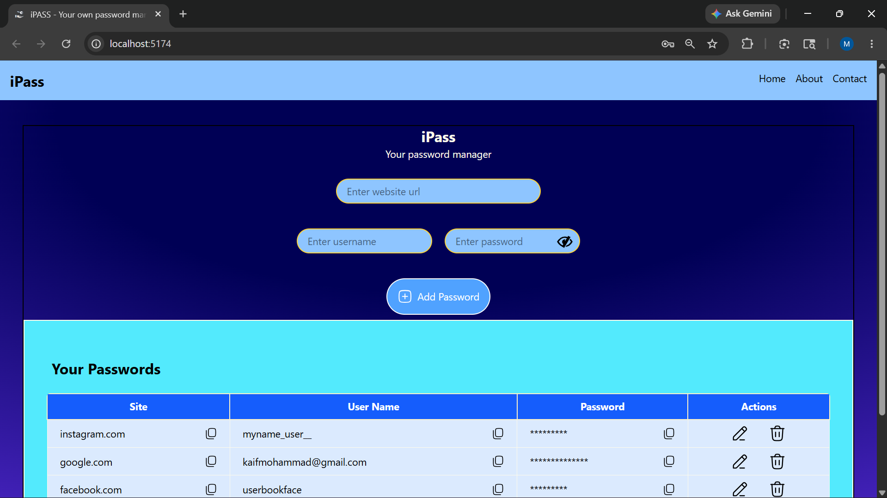

# Password Manager (MongoDB Version) 🔐

## 📌 Description

A full-stack password manager application built using React, Tailwind CSS, Node.js, Express.js, and MongoDB. The application allows users to securely store, edit, delete, and manage passwords with persistent database storage.

## 🚀 Features

* Add passwords
* Edit saved passwords
* Delete passwords
* Copy credentials to clipboard
* Store passwords in MongoDB
* Responsive UI
* Toast notifications

## 🛠️ Tech Stack

### Frontend

* React.js
* Tailwind CSS
* React Toastify

### Backend

* Node.js
* Express.js

### Database

* MongoDB

## 📂 Functionalities Implemented

* CRUD operations
* API integration using fetch()
* React state management
* Dynamic rendering
* Clipboard API usage

## ▶️ How to Run

### Frontend

```bash
npm install
npm run dev
```

### Backend

```bash
npm install
node server.js
```

## ⚠️ Environment Variables

Create a `.env` file and add your MongoDB connection string:

```env
MONGO_URI=your_mongodb_connection_string
```

## 📷 Screenshots

### DashBoard


## 🌐 Future Improvements

* Password encryption
* Authentication system
* JWT authorization
* Better UI/UX

## 👨‍💻 Author

Your Name
